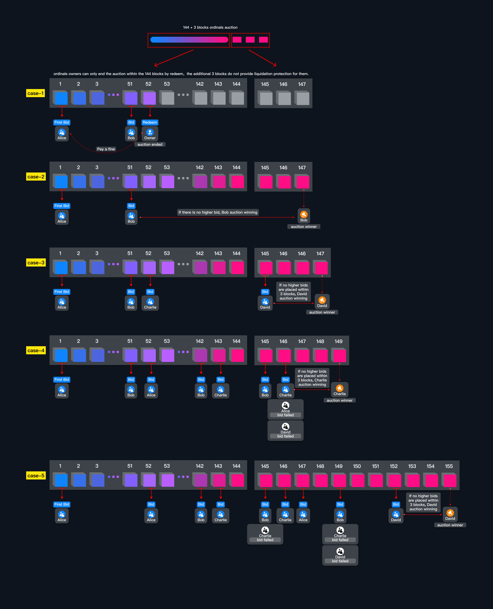

# What is 144 + 3 blocks ordinals auction?

The 144 + 3 block auction system is designed for the liquidation of ordinals through an on-chain auction. The 144 blocks roughly equate to 24 hours (6 blocks per hour), ensuring that ordinals owners won’t lose their assets unexpectedly due to a brief absence, such as during sleep or travel. However, once the auction starts, **ordinals owners can only end the auction within the 144 blocks by redeem,** **the additional 3 blocks do not provide liquidation protection for them.**

The +3 blocks to make sure that the ordinals owner can sell their collateral on-chain for a fair price to get the value back after repaying debt, each higher bid should be 1% more than last highest bid.

We can use one image to explain how ordinals on-chain auction work:

<figure><figcaption></figcaption></figure>

#### Case 1:

* David borrowed 0.1 BTC against his ordinals when the floor price of his ordinals was 0.2 BTC.
* David unable to repay the loan, the floor price drops to make his loan health factor lower than 1.
* Alice's success started the auction by first bidding David's ordinals at block height #1.
* Bob bided higher at block height #51, Alice get her bid money back in Bob's transaction.
* David redeemed the ordinals to stop the auction in 144 blocks at block height #52, Bob get his bid money back and Alice get first bid bonus 0.005 BTC in the redeem transaction.

#### Case 2:

* David borrowed 0.1 BTC against his ordinals when the floor price of his ordinals was 0.2 BTC.
* David unable to repay the loan, the floor price drops to make his loan health factor lower than 1.
* Alice's success started the auction by first bidding David's ordinals at block height #1.
* Bob bided higher at block height #51, Alice get her bid money back in Bob's transaction.
* No more bid, Bob is the winer of the auction at block height #147(144 + 3), Bob liquidate the ordinals by repaying the debt to the pool and (the\_money\_bid - debt) goes to David. After liquidate, Bob withdraw the ordinals from the auction system.

#### Case 2:

* David borrowed 0.1 BTC against his ordinals when the floor price of his ordinals was 0.2 BTC.
* David unable to repay the loan, the floor price drops to make his loan health factor lower than 1.
* Alice's success started the auction by first bidding David's ordinals at block height #1.
* Bob bided higher at block height #51, Alice get her bid money back in Bob's transaction.
* After block height #144, Alex can not redeem to stop the auction anymore.
* No more bid, Bob is the winer of the auction at block height #147(144 + 3), Bob liquidate the ordinals by repaying the debt to the pool and (the\_money\_bid - debt) goes to David. After liquidate, Bob withdraw the ordinals from the auction system.

#### Case 3:

* Alex borrowed 0.1 BTC against his ordinals when the floor price of his ordinals was 0.2 BTC.
* Alex unable to repay the loan, the floor price drops to make his loan health factor lower than 1.
* Alice's success started the auction by first bidding David's ordinals at block height #1.
* Bob bided higher at block height #51, Alice get her bid money back in Bob's transaction.
* Charlie bided higher at block height #52, Bob get his bid money back in Charlie's transaction.
* After block height #144, Alex can not redeem to stop the auction anymore.
* David bid higher at block height #145 and no more bid to block height#147, David is the winer of the auction at block height #147(144 + 3), David liquidate the ordinals by repaying the debt to the pool and (the\_money\_bid - debt) goes to Alex. After liquidate, David withdraw the ordinals from the auction system.

#### Case 4:

* Alex borrowed 0.1 BTC against his ordinals when the floor price of his ordinals was 0.2 BTC.
* Alex unable to repay the loan, the floor price drops to make his loan health factor lower than 1.
* Alice's success started the auction by first bidding David's ordinals at block height #1.
* Bob, Alice, Charlie out bid each others to make the bid higher and higher.
* Charlie bided higher at block height #52, Bob get his bid money back in Charlie's transaction.
* After block height #144, Alex can not redeem to stop the auction anymore.
* Charlie, Alice and David both bid at height #146, Charlie win the on-chain competition against Alice & David. No more bid to block height #149(146 + 3), Charlie is the winer of the auction at block height #149, Charlie liquidate the ordinals by repaying the debt to the pool and (the\_money\_bid - debt) goes to Alex. After liquidate, Charlie withdraw the ordinals from the auction system.

#### Case 5:

* Alex borrowed 0.1 BTC against his ordinals when the floor price of his ordinals was 0.2 BTC.
* Alex unable to repay the loan, the floor price drops to make his loan health factor lower than 1.
* Alice's success started the auction by first bidding David's ordinals at block height #1.
* Bob, Alice, Charlie out bid each others to make the bid higher and higher.
* Charlie bided higher at block height #52, Bob get his bid money back in Charlie's transaction.
* After block height #144, Alex can not redeem to stop the auction anymore.
* Alice, Bob, Charlie join the auction after block height #145. Bob, Charlie and David both bid at height #149, Bob win the on-chain competition against David & Charlie. David out bid bob at block height #152, No more bid to block height #155(152 + 3), David is the winer of the auction at block height #155, David liquidate the ordinals by repaying the debt to the pool and (the\_money\_bid - debt) goes to Alex. After liquidate, David withdraw the ordinals from the auction system.

#### Why Use Block Height Instead of Timestamp?

We prefer block height over timestamps for auction management to mitigate risks associated with varying block times. Occasionally, Bitcoin can produce two blocks simultaneously, and the longest interval between two blocks can be up to two hours. However, the chance of three blocks being generated at the same time is exceedingly low.

Using block height ensures that users can submit auction transactions with higher gas fees in the mempool, reducing the reliance on luck regarding block timing and minimizing advantages for mining pools that might attempt to exploit auctions.
