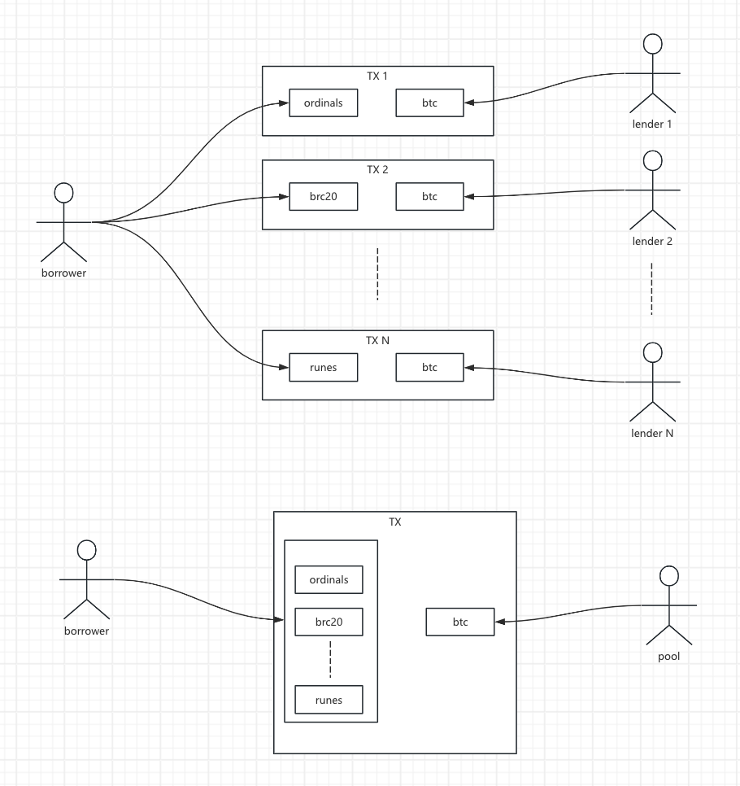

# Batch borrows in one transaction

Whales can batch borrow against multiple collateral assets in a single transaction, comparing to peer-to-peer lending one transaction for each collateral, this is way more efficient.&#x20;

***

