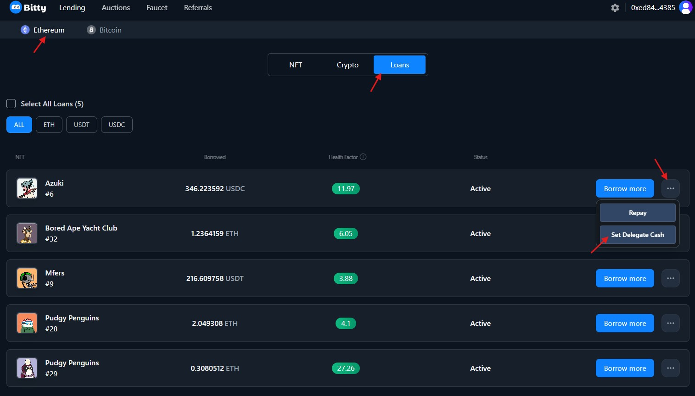

# How to implements pool lending without smart contract?

While EVM provide Turing complete smart contact, bitcoin service is more relied on&#x20;

* PBST
* Multi-sig
* Discreet Log Contracts (DLCs)

This is how peer to peer lending service build:

<figure><figcaption></figcaption></figure>

This is how peer to pool lending service build:

<figure><figcaption></figcaption></figure>

