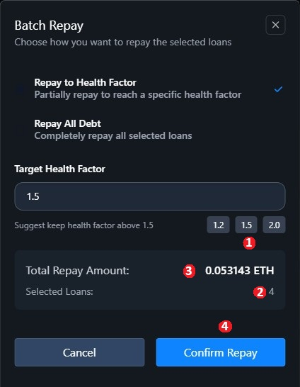
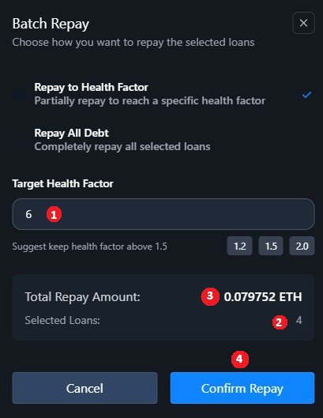

# Repay loan & interests (ETH)

1\.    Visit the [Bitty.io](https://bitty.io/lending/ethereum/nft) website, connect your wallet in the top right corner.

<figure><figcaption></figcaption></figure>

2\.    Click "Loans”.

<figure><figcaption></figcaption></figure>

3\.    Click the three dots next to “Borrow Against”, click “Repay”.

<figure><figcaption></figcaption></figure>

4\.    The “Repay” page will pop up, you can input the amount as you like.

<figure><figcaption></figcaption></figure>

5\.    Input the "Amount", check “HF change after Repay”, check “Deft after repaid”, click “OK”.

<figure><figcaption></figcaption></figure>

6\.    Your wallet will pop up, confirm your account, click "Loans", check the “Borrowed” amount, check the “Health Factor”.

<figure><figcaption></figcaption></figure>

7\.    If you want to pay off, click the three dots next to “Borrow Against”, click “Repay”.

<figure><figcaption></figcaption></figure>

8\.    The “Repay” page will pop up, click “MAX”.

<figure><figcaption></figcaption></figure>

9\.    Check “Amount”, you won’t have any debt after Repay, Debt after repaid is 0, click “OK”.

<figure><figcaption></figcaption></figure>

10\.   The loans will be cleared.

<figure><figcaption></figcaption></figure>

11\.    Click “NFT”, check “Wallet Balance”, increased by 1. The NFT you repaid is back your wallet.

<figure><figcaption></figcaption></figure>
