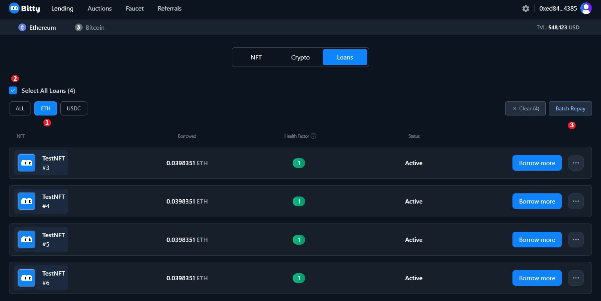

# Repay multiple NFT loans in one transaction (ETH)

1\. Visit the [Bitty.io](https://bitty.io/lending/ethereum/nft) website, connect your wallet in the top right corner, click "Ethereum"
, click "Loans".

<figure><figcaption></figcaption></figure>

2\. There are 4 NFTs borrowing ETH with a Health Factor of 1, which means they are at risk of being liquidated.&#x20;

We start to repay 4 NFT loans in one transaction,
&#x20;click "ETH"
, tick "Select All Loans"
, click "Batch Repay".

<figure><figcaption></figcaption></figure>

3\. The Batch Repay Page pops up.
\

<figure><figcaption></figcaption></figure>

4\. We can choose one of three operations:
\
&#x20; ( 1 ) Select "Target Health Factor" with suggested,&#x20;
check "Selected Loans"
, check "Total Repay Amount",
&#x20;click "Confirm Repay".

<figure><figcaption></figcaption></figure>

Your wallet will pop up, confirm your account, click "Ethereum",
&#x20;click "Loans".
\
Health Factor has changed to the Target Health Factor you just selected, successfully completing multiple NFT repayments in one transaction.

<figure><figcaption></figcaption></figure>

( 2 )  Input the number as you like, check "Selected Loans"
, check "Total Repay Amount"
, click "Confirm Repay".

<figure><figcaption></figcaption></figure>

Your wallet will pop up, confirm your account, click "Ethereum"
, click "Loans".
\
Health Factor has changed to the Target Health Factor you just inputted, successfully completing multiple NFT repayments in one transaction.

<figure><figcaption></figcaption></figure>

( 3 ) Click " Repay All Debt " to completely repay all selected loans.

<figure><figcaption></figcaption></figure>

Check "Selected Loans"
, check "Total Repay Amount"
, click "Confirm Repay"

<figure><figcaption></figcaption></figure>

Your wallet will pop up, confirm your account, click "Ethereum"
, click "Loans"
. The loans for NFTs you just repaid are cleared.

<figure><figcaption></figcaption></figure>

Click " NFT " and you will find your NFTs back to your wallet.

<figure><figcaption></figcaption></figure>
