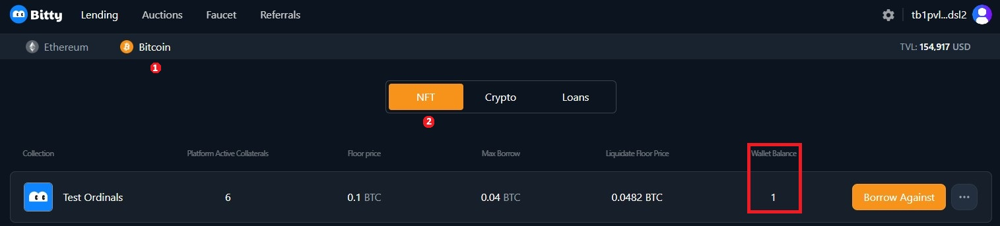
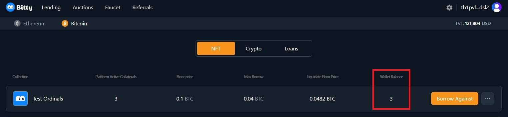

# Repay multiple Ordinals loans in one transaction

1\. Visit the [Bitty.io](https://bitty.io/lending/bitcoin/nft) website, connect your wallet in the top right corner, click "Bitcoin", click "Loans".

<figure><figcaption></figcaption></figure>

2\. There are 3 ordinals  with a Health Factor of 1.05, which means they are at risk of being liquidated.

We start to repay 3 ordinals loans in one transaction, tick "Select All Loans", click "Batch Repay".

<figure><figcaption></figcaption></figure>

3. The Batch Repay Page pops up.

<figure><figcaption></figcaption></figure>

4. We can choose one of three operations:

&#x20; ( 1 ) Select "Target Health Factor" with suggested, check "Selected Loans", check "Total Repay Amount", click "Confirm Repay".

<figure><figcaption></figcaption></figure>

Your wallet will pop up, confirm your account, click "Bitcoin", click "Loans". Health Factor has changed to the Target Health Factor you just selected, successfully completing multiple ordinals repayments in one transaction.

<figure><figcaption></figcaption></figure>

( 2 ) Input the number as you like, check "Selected Loans", check "Total Repay Amount", click "Confirm Repay".

<figure><figcaption></figcaption></figure>

Your wallet will pop up, confirm your account, click "Bitcoin", click "Loans".Health Factor has changed to the Target Health Factor you just inputted, successfully completing multiple NFT repayments in one transaction.

<figure><figcaption></figcaption></figure>

( 3 ) Click " Repay All Debt " to completely repay all selected loans.

<figure><figcaption></figcaption></figure>

Check "Selected Loans", check "Total Repay Amount", click "Confirm Repay"

<figure><figcaption></figcaption></figure>

Your wallet will pop up, confirm your account, click "Bitcoin", click "Loans". The loans for 3 ordinals you just repaid are cleared.

<figure><figcaption></figcaption></figure>

5. We start to transfer 3 ordinals back to your wallet.

Click three dots next to “Borrow”, click"Withdraw Collateral"

<figure><figcaption></figcaption></figure>

6. Your wallet will pop up, confirm your account,click "Bitcoin", click "NFT" and you will find your ordinals back to your wallet.

<figure><figcaption></figcaption></figure>

7. After completing the same operation to other 2 ordinals, you will find all 3 ordinals back to your wallet.

<figure><figcaption></figcaption></figure>
