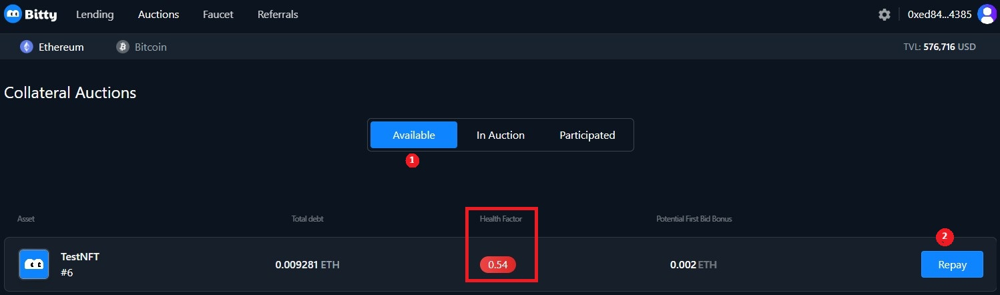

# Avoid to be liquidated by repay (ETH)

1\.    Visit the [Bitty.io](https://bitty.io/lending/ethereum/nft) website, connect your wallet in the top right corner, click "Auctions”. &#x20;

<figure><figcaption></figcaption></figure>

2\.    Click “Available”; HF of your NFT is below 1, in danger of being liquidated; Click “Repay”.&#x20;

<figure><figcaption></figcaption></figure>

3\.    The “Repay” page pops up, you can input any amount as you like.

<figure><figcaption></figcaption></figure>

4\.    Input the “Amount”, check “HF will change after repay”, Check “Debt after repay”, Click “OK”; Your wallet will pop up, confirm your account.&#x20;

<figure><figcaption></figcaption></figure>

5\.    Click “Loans”, check “Health Factor”. If you want to pay off your debt, click the three dots next to “Borrow more”.&#x20;

<figure><figcaption></figcaption></figure>

6\.    The “Repay” page will pop up, click “MAX”, click “OK”.&#x20;

<figure><figcaption></figcaption></figure>

7\.    Click “Loans”; Your loans are cleared.&#x20;

<figure><figcaption></figcaption></figure>

8\.    Click “NFT”, check your wallet balance, increased by 1. The NFT you paid off comes to your wallet.&#x20;

<figure><figcaption></figcaption></figure>
