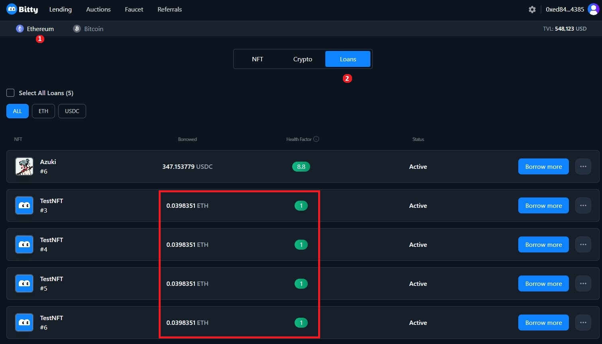
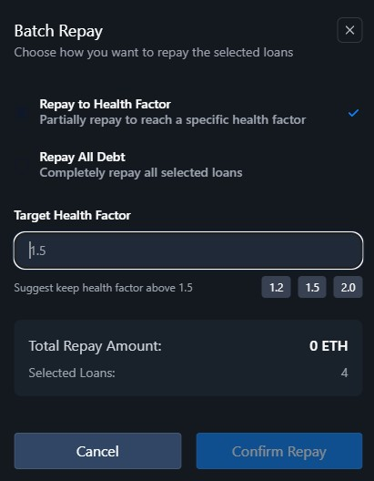
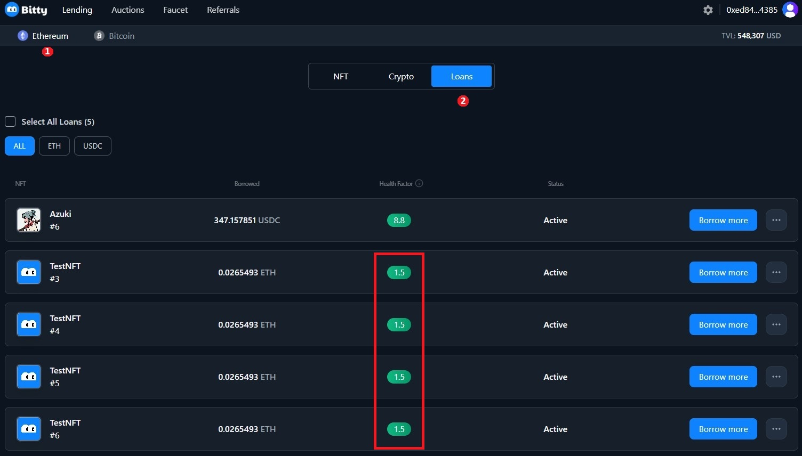
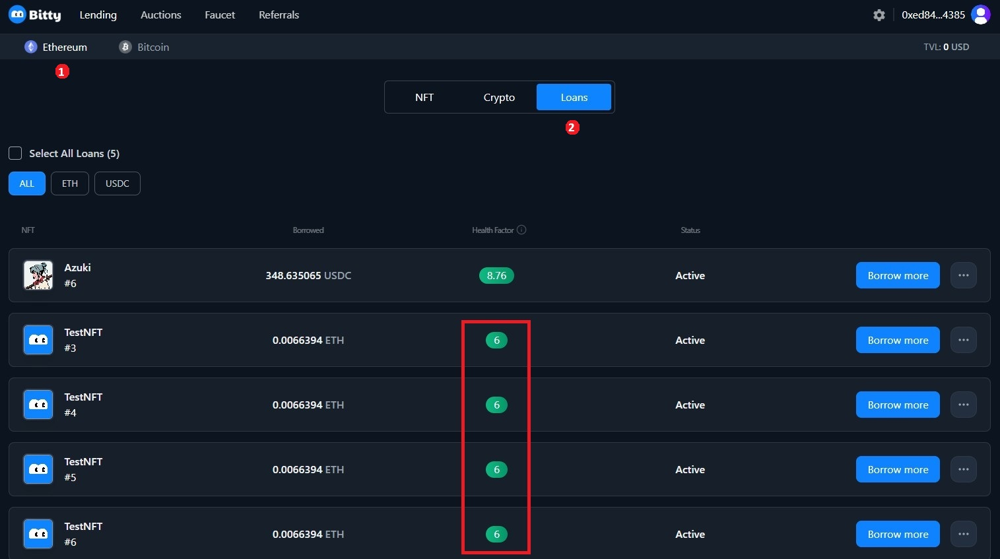
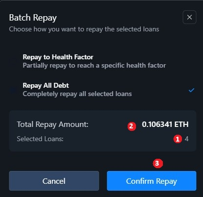
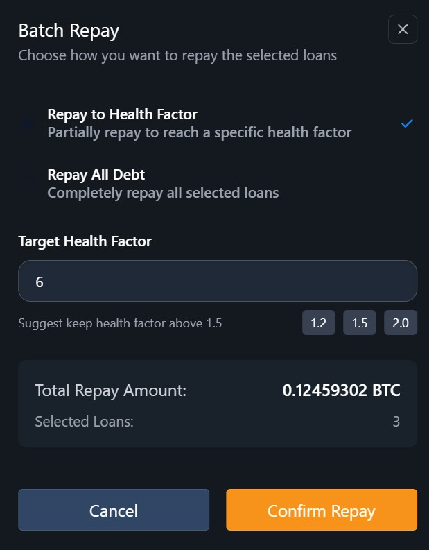

# Redeem your NFT in auction (ETH)

1\.    Visit the [Bitty.io](https://bitty.io/lending/ethereum/nft) website, connect your wallet in the top right corner, click "Auctions”. &#x20;

<figure><figcaption></figcaption></figure>

2\.    Click “Loans”; HF of your NFT is below 1, in danger of being liquidated; You need to repay in time.&#x20;

<figure><figcaption></figcaption></figure>

3\.    If you failed to repay it in time, the first bidder could trigger the auction.&#x20;

<figure><figcaption></figcaption></figure>

4\.    Click “In Auction”, click “Redeem”.&#x20;

<figure><figcaption></figcaption></figure>

5\.    Click “Redeem”; Your wallet will pop up, confirm your account.&#x20;

<figure><figcaption></figcaption></figure>

6\.    Click “Loans”; The HF is over 1; Your NFT is safe.&#x20;

<figure><figcaption></figcaption></figure>
